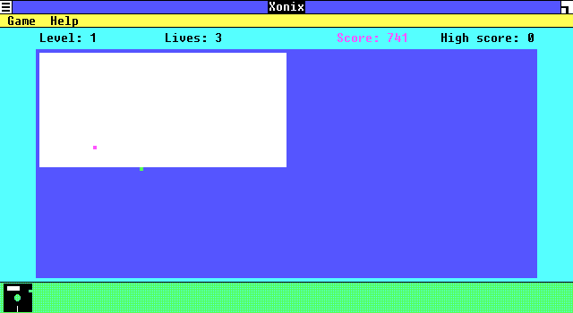
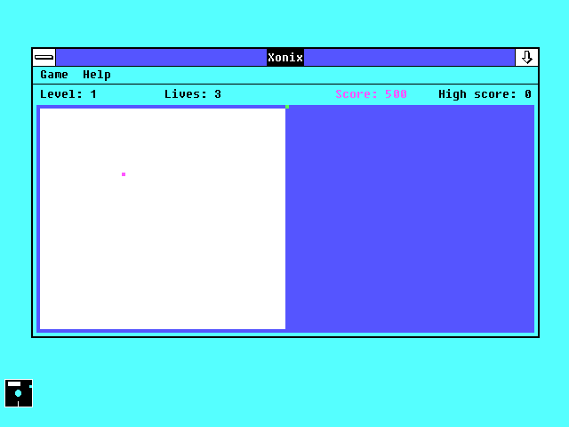
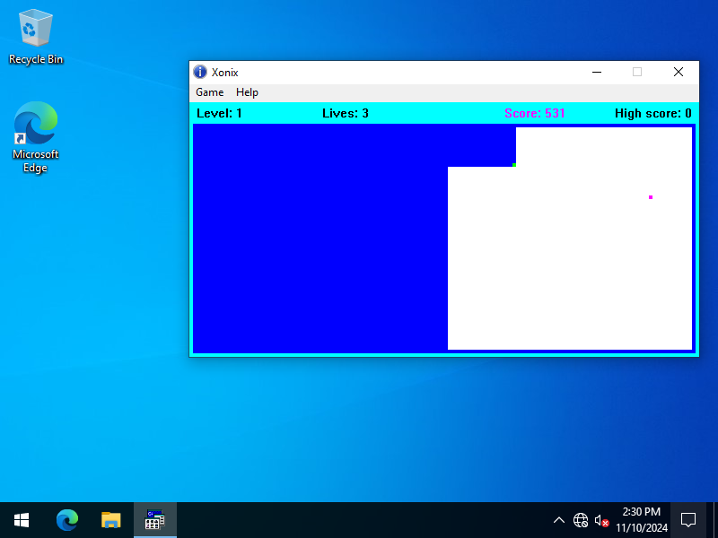

# Windows 1.0 and the WinAPI, 40 Years Later

I finally decided to write an application for the very first version of Windows and see how different the modern WinAPI really is from its earliest versions. Windows 1.0 came out back in the mid-1980s – the era of 16-bit processors, MS-DOS, and cooperative multitasking. At first glance, you might think it has almost nothing in common with modern Windows, but when you look specifically at the application API, that's where things get interesting.

I wanted to see how far it would be possible to go using only the capabilities of the first version of Windows. I didn't want to just make a minimal example with a window and a menu, but a small, complete application with graphics, keyboard input, timers, and constant redrawing. For this experiment, I chose Xonix – a simple yet surprisingly addictive game.



## Tools and Architecture

For the project, I used Microsoft C 4.0 – a compiler from the early Windows era, implementing K&R C before the ANSI C standard existed. Because of this, the code uses the old function declaration style and obsolete compiler extensions such as FAR and PASCAL.

Today, this style looks quite archaic, but it reflects the original WinAPI programming model exactly – no C++, no modern abstractions, just C and direct system calls.

Back then, a window procedure looked like this:

```cpp
LRESULT FAR PASCAL WndProc(hWnd, message, wParam, lParam)
HWND hWnd; unsigned int message; WPARAM wParam; LPARAM lParam;
{
...
}
```

Despite the system's age, the application architecture was unexpectedly familiar. Even at that time, almost all the core WinAPI mechanisms already existed: window procedures, the message loop, timers, resources, keyboard handling, and mouse input.

The classic message loop looked almost exactly the same as it does today:

```cpp
while (GetMessage(&msg, NULL, 0, 0))
{
    if (!TranslateAccelerator(hWnd, hAccelTable, &msg))
    {
        TranslateMessage(&msg);
        DispatchMessage(&msg);
    }
}
```

That was probably the most surprising part of the entire experiment: internally, Windows has changed enormously over the decades, yet the application interface has stayed so stable that code written in the mid-1980s still looks completely familiar.

## Game implementation

The game uses only the most basic system functionality: WM_PAINT handling, SetTimer, graphics output through GDI, and keyboard messages. No external libraries or non-standard components – only what was already available in the very first version of Windows.

I deliberately stuck to the programming style of that era and aimed for smooth performance on an original IBM PC with minimal hardware resources.
The exact same code compiles without changes across different Windows SDK versions – from Windows 1.0 all the way to modern 64-bit systems. Only the compiler and build settings change. Aside from a few minor missing definitions in early WinAPI headers, the code is completely portable.

For a project targeting a mid-1980s operating system, that level of compatibility feels remarkably unusual.

The project source code and a compiled binary are available in the repository.

Of course, the limitations of early Windows versions feel unusual today. The system uses cooperative multitasking – if an application blocks message processing for too long, the whole system freezes. There is no double buffering, which causes noticeable flickering during active redraws. Memory is also extremely limited, and many things we now take for granted had to be done by hand.



## Compatibility testing

Another interesting part of the experiment was testing the compatibility of the already compiled 16-bit EXE across later Windows versions.

The program runs unchanged on systems ranging from Windows 1.x to 32-bit versions of Windows 10. However, there are some exceptions. For example, it does not start on Windows 95. This is likely due to compatibility differences in the Win16 subsystem in the Windows 9x line rather than a fundamental limitation of Win16 itself.

On modern 64-bit versions of Windows, the program also won't run, as support for 16-bit Windows applications has been removed.



This demonstrates true binary-level compatibility: the same compiled EXE file runs on different systems without recompilation or modification.

## Conclusion

The main conclusion from the entire experiment is just how successful the original WinAPI design turned out to be. Despite the huge number of internal changes Windows has gone through over the last several decades, Microsoft managed to preserve the core application model with remarkably few changes.

Because of this, code originally written for Windows 1.0 remains not only recognizable, but in some cases still compiles and runs more than forty years later.

In an industry where technologies and frameworks often become obsolete within just a few years, that kind of longevity is quite remarkable.
